# Инструкция для ППС: Codex app + плагин Sylabys Syllabus Checker

Эта инструкция для преподавателей и сотрудников, которые не работают с командной строкой. Все действия ниже выполняются через приложение Codex и обычные окна Windows.

Важно: если экран у вас немного отличается от скриншота, ориентируйтесь на название кнопки. Интерфейс Codex может обновляться.

## Что получится в конце

Вы сможете загрузить в Codex комплект документов по дисциплине и получить аудит силлабуса в PDF:

```text
reports\final-report.pdf
```

Плагин проверяет:

- структуру силлабуса;
- цель и результаты обучения;
- соответствие ОП, РУП и силлабусу;
- темы и результаты обучения;
- распределение часов: лекции, ПЗ, СРОП, СРО;
- форму итогового контроля;
- литературу;
- вопросы для итогового контроля.

Отчёт будет написан простым русским языком: что исправить, где исправить, уровень исправления, доказательство и как исправить.

## Перед началом

Нужно иметь:

- Windows 10 или Windows 11;
- интернет;
- аккаунт ChatGPT / OpenAI с доступом к Codex;
- установленный Git for Windows;
- доступ к GitHub-репозиторию плагина:
  <https://github.com/Astana-Medical-University/sylabys-codex-plugins>
- Microsoft Edge или Google Chrome, чтобы создавался PDF.

Команды `codex plugin ...` для ППС не используются. Git Bash открывать не нужно. Но сам Git for Windows должен быть установлен, иначе Codex app не сможет добавить marketplace из GitHub.

## 1. Установить Codex app

Откройте ссылку:

<https://get.microsoft.com/installer/download/9PLM9XGG6VKS?cid=website_cta_psi>

Нажмите `Установить` / `Install`.

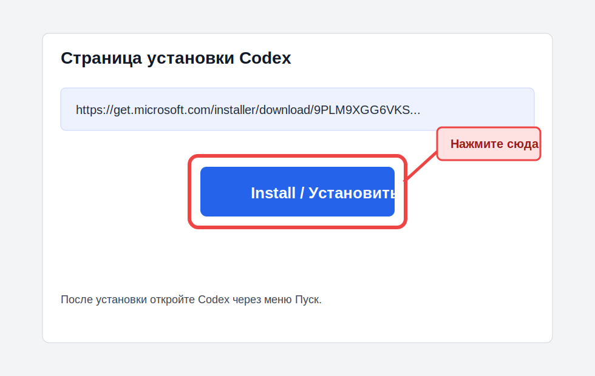

После установки:

1. Откройте меню `Пуск`.
2. Найдите `Codex`.
3. Откройте приложение.

## 2. Войти в Codex

1. В Codex нажмите `Sign in` / `Войти`.
2. В браузере войдите в аккаунт ChatGPT / OpenAI.
3. Если появится выбор workspace, выберите workspace университета.
4. Вернитесь в Codex.

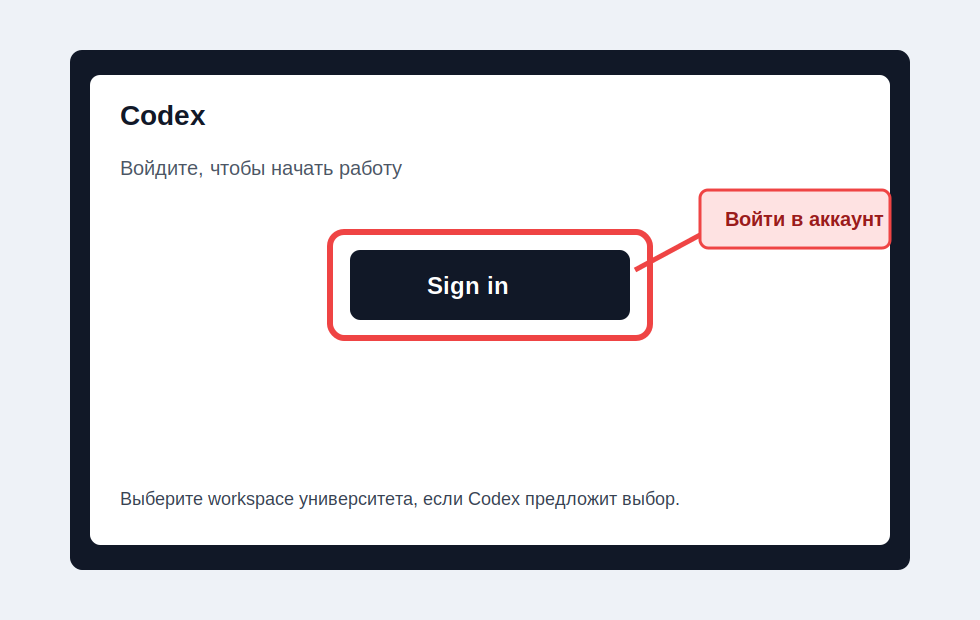

Если вход не получается, проверьте:

- правильный ли аккаунт используется;
- есть ли у аккаунта доступ к Codex;
- не заблокирован ли вход политикой университета;
- включена ли двухфакторная проверка, если она требуется.

## 3. Установить Git for Windows

Git нужен не для работы в командной строке, а как системная программа. Codex app использует Git, чтобы скачать marketplace плагина из GitHub.

Если Git не установлен, добавление marketplace из GitHub может не сработать.

1. Откройте ссылку:

   <https://git-scm.com/download/win>

2. Скачайте установщик `Git for Windows`.
3. Откройте скачанный файл.
4. В мастере установки нажимайте `Next`, оставляя настройки по умолчанию.
5. В конце нажмите `Install`, затем `Finish`.
6. Полностью закройте Codex app.
7. Откройте Codex app заново.

Если на компьютере университета установка программ запрещена, попросите ИТ-специалиста установить `Git for Windows`.

Важно: после установки Git не нужно открывать Git Bash. Просто продолжайте работу в Codex app.

## 4. Добавить marketplace плагина в Codex app

Marketplace - это источник, откуда Codex берёт плагины. Наш marketplace лежит в GitHub:

<https://github.com/Astana-Medical-University/sylabys-codex-plugins>

1. Откройте Codex.
2. Слева нажмите `Плагины`.
3. В правом верхнем углу откройте выпадающее меню со стрелкой `>` / `⌄`.
4. В меню нажмите `Добавить маркетплейс`.

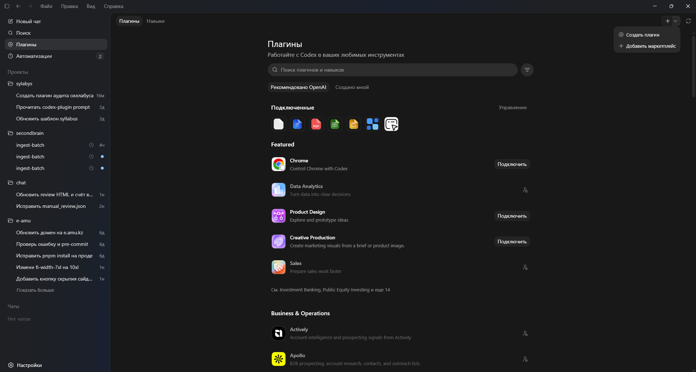

Откроется окно `Добавить маркетплейс плагинов`.

Заполните поля так:

```text
Источник:
https://github.com/Astana-Medical-University/sylabys-codex-plugins

Git ref:
main

Выборочные пути:
не трогать, оставить как есть
```

Важно: если в поле `Выборочные пути` серым текстом показано `plugins/codex`, это подсказка-пример. Обычно это поле заполнять не нужно. Вписывайте туда что-либо только если администратор отдельно попросил.

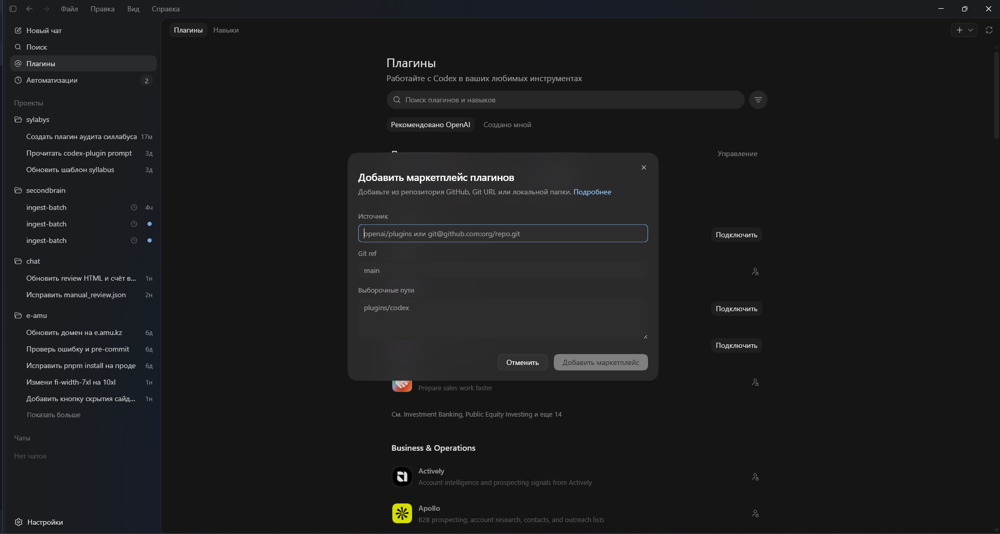

После заполнения нажмите `Добавить маркетплейс`.

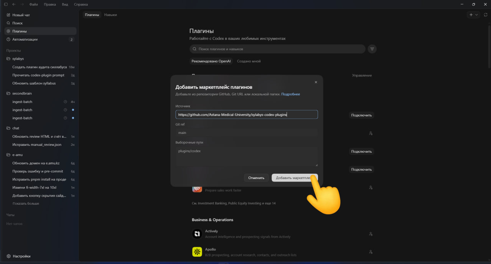

Подождите, пока Codex добавит marketplace. Это может занять от нескольких секунд до минуты.

Если появится ошибка:

- проверьте интернет;
- проверьте, что установлен Git for Windows;
- проверьте, что ссылка скопирована полностью;
- проверьте, что у вас есть доступ к GitHub-репозиторию;
- закройте окно и повторите ещё раз.

## 5. Проверить, что плагин включён

После добавления marketplace в списке появится вкладка `Sylabys Codex Plugins`.

1. Откройте `Плагины`.
2. Нажмите вкладку `Sylabys Codex Plugins`.
3. Найдите `Sylabys Syllabus Checker`.
4. Справа нажмите `Подключить`.
5. Дождитесь, пока кнопка изменится на состояние подключённого плагина.

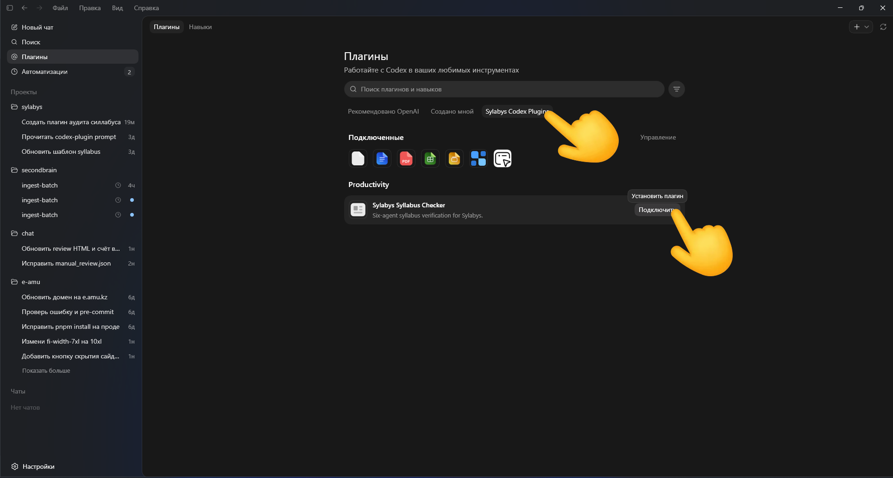

Если плагина нет:

- проверьте, что вы вошли в правильный workspace;
- проверьте, что установлен Git for Windows;
- проверьте, что marketplace добавлен без ошибки;
- проверьте, что вкладка `Sylabys Codex Plugins` появилась рядом с `Рекомендовано OpenAI` и `Создано мной`;
- перезапустите Codex.

После подключения плагина откройте новый чат. В старом чате Codex может не увидеть только что подключённый плагин.

## 6. Подготовить папку `syllabus_group`

Создайте папку, где будут лежать документы для проверки. Например:

```text
D:\syllabus_group
```

Внутри создайте отдельную папку для каждой дисциплины:

```text
D:\syllabus_group\anatomy_1
D:\syllabus_group\pathophysiology_1
D:\syllabus_group\pharmacology_1
```

Для одной проверки в одной папке должны быть только документы одной дисциплины.

## 7. Что положить в папку дисциплины

Пример правильной папки:

```text
D:\syllabus_group\anatomy_1
  Анатомия силлабус.docx
  Приложение 6 паспорт ОП Медицина.docx
  РУП 1 курс медицина.xlsx
```

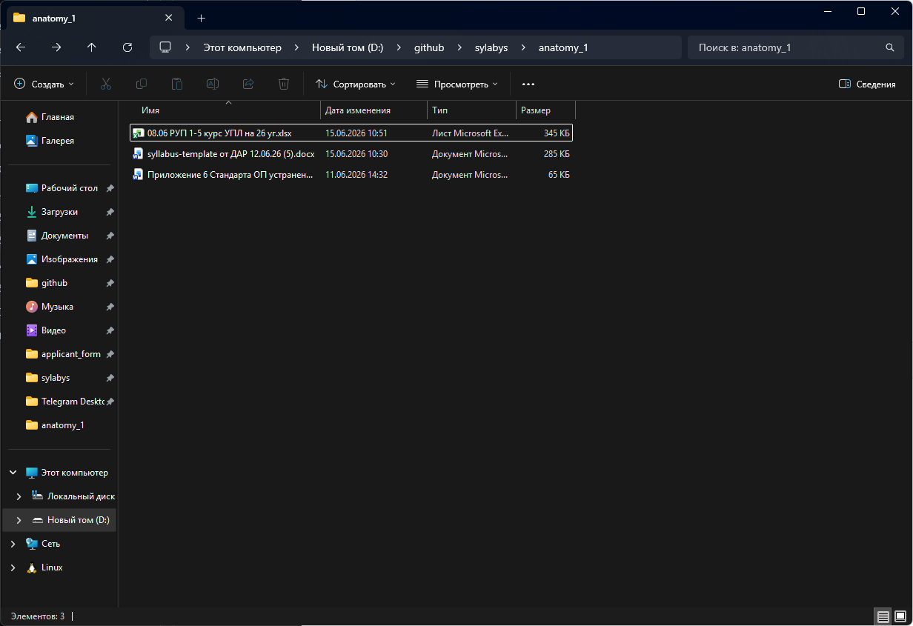

Обязательно нужны три файла:

1. Силлабус в формате `.docx`.
2. Паспорт ОП / приложение 6 в формате `.docx`.
3. РУП / учебный план в формате `.xlsx`.

Чтобы плагин сам нашёл документы, используйте понятные названия:

- для ОП: `Приложение 6`, `паспорт ОП`, `стандарта ОП`;
- для РУП: `РУП`, `учебный план`;
- для силлабуса: название дисциплины + слово `силлабус`.

Не кладите в эту же папку:

- старые версии силлабуса;
- другие дисциплины;
- PDF вместо Word;
- сканы;
- фотографии документов;
- файлы с паролем.

Перед запуском закройте Word и Excel.

## 8. Открыть папку дисциплины в Codex

1. Откройте Codex.
2. Под полем ввода откройте список проектов.
3. Нажмите `Добавить новый проект`.
4. Выберите `Использовать существующую папку`.

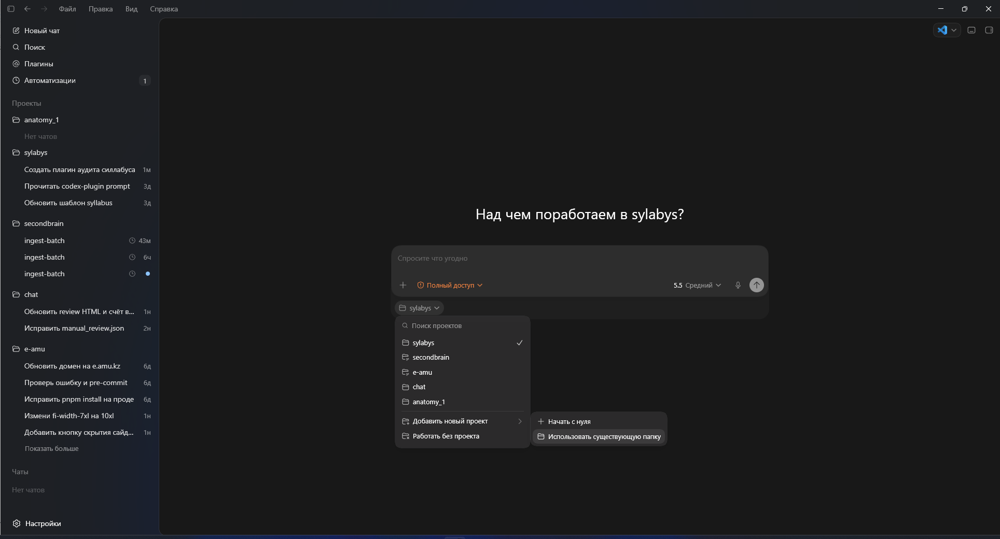

5. В окне выбора папки откройте папку дисциплины, например:

   ```text
   D:\syllabus_group\anatomy_1
   ```

6. Нажмите `Выбор папки`.

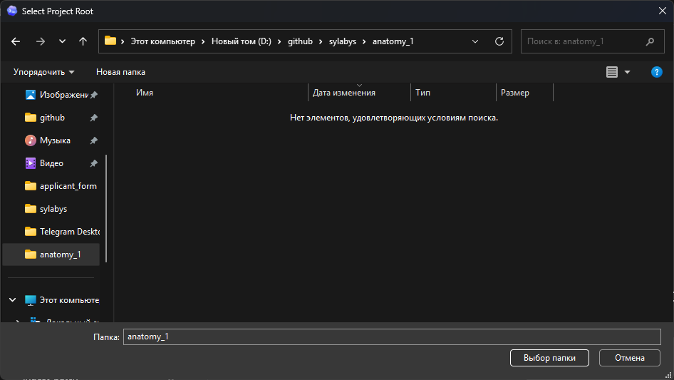

7. Откройте новый чат по этой папке.

## 9. Запустить аудит

В новом thread вставьте такой текст. Замените путь и название файла на свои.

```text
Используй плагин Sylabys Syllabus Checker.

Проверь силлабус:
D:\syllabus_group\anatomy_1\Анатомия силлабус.docx

ОП и РУП лежат в этой же папке:
D:\syllabus_group\anatomy_1

Сделай аудит на русском языке:
- что исправить;
- где исправить;
- уровень исправления;
- доказательство;
- как исправить;
- отдельно выпиши форму итогового контроля;
- проверь распределение часов Л/ПЗ/СРОП/СРО;
- проверь литературу;
- подготовь вопросы для итогового контроля;
- сделай PDF-отчёт.

Отчёты сохрани в папке reports.
```

Нажмите кнопку отправки сообщения.

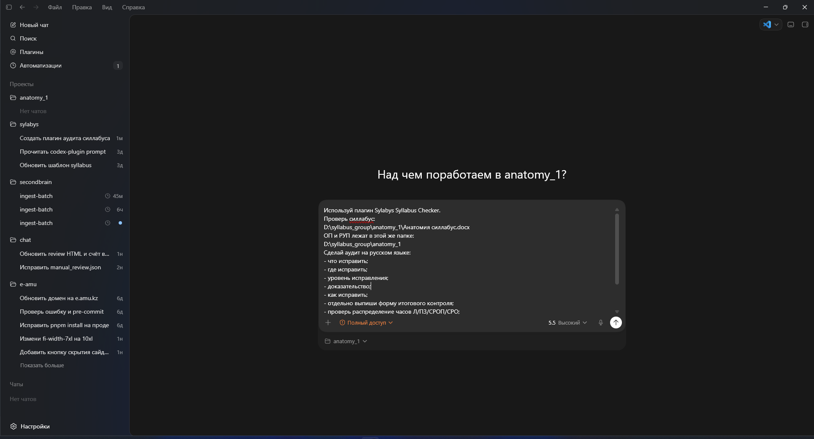

Проверка может занять несколько минут. Не закрывайте Codex, пока идёт аудит.

## 10. Как поставить режим подтверждений

Перед запуском аудита откройте меню подтверждений под полем ввода.

Выберите режим `Подтверждать автоматически` / `Автоподтверждение`.

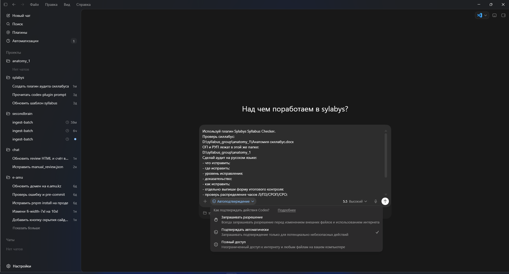

Что означает этот режим:

- Codex сам подтверждает обычные безопасные действия;
- Codex всё равно спросит разрешение, если действие потенциально опасное;
- этот режим удобнее, чем каждый раз нажимать `Разрешить` вручную.

Не выбирайте `Полный доступ`, если администратор или ответственный за проверку отдельно не сказал это сделать. Для обычного аудита силлабуса достаточно `Подтверждать автоматически`.

Не разрешайте действие, если Codex предлагает удалить исходные документы или изменить исходный силлабус. Плагин должен создавать отчёт, а не исправлять файл вместо вас.

## 11. Где найти результат

После окончания проверки откройте папку:

```text
D:\syllabus_group\anatomy_1\reports
```

Главный файл:

```text
final-report.pdf
```

Дополнительные файлы:

```text
final-report.md
final-report.html
final-report.json
```

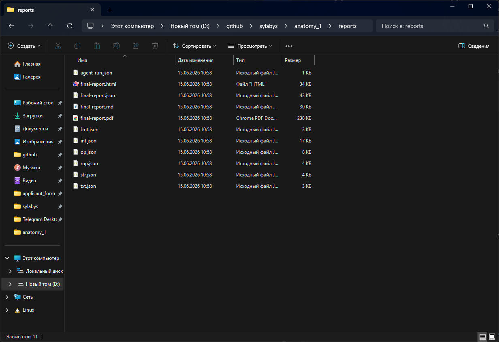

Если PDF не создался:

1. Откройте `final-report.html`.
2. Нажмите `Ctrl + P`.
3. Выберите `Save as PDF`.
4. Сохраните PDF вручную.

## 12. Как читать аудит

Откройте `final-report.pdf`.

Сначала смотрите раздел `Исполнительное заключение`.

Возможные статусы:

- `ПРИНЯТ` - серьёзных замечаний нет;
- `ПРИНЯТ С ЗАМЕЧАНИЯМИ` - можно принять, но лучше исправить замечания;
- `НА ДОРАБОТКУ` - есть существенные замечания;
- `ОТКЛОНЁН` - документ нельзя утверждать до исправлений.

Главный раздел отчёта - `Что исправить`.

В таблице:

- `Где исправить` - раздел документа;
- `Уровень исправления` - насколько серьёзно;
- `Доказательство` - на основании чего сделан вывод;
- `Что не так` - проблема;
- `Как исправить` - что сделать.

Исправлять нужно в таком порядке:

1. `Критический`.
2. `Существенный`.
3. `Точечный`.
4. `Ручная экспертиза`.

## 13. Что делать после исправления

1. Исправьте силлабус в Word.
2. Сохраните новую версию, например:

   ```text
   Анатомия силлабус исправлено.docx
   ```

3. Старую версию уберите в подпапку:

   ```text
   old
   ```

4. Запустите аудит повторно по новой версии.
5. Сравните новый `final-report.pdf` со старым.

## 14. Частые проблемы

### Плагин не отображается

Что сделать:

1. Перезапустите Codex.
2. Откройте новый чат.
3. Откройте `Плагины`.
4. Проверьте, появилась ли вкладка `Sylabys Codex Plugins`.
5. Если вкладки нет, повторите добавление marketplace через правое верхнее выпадающее меню со стрелкой `>` / `⌄`.
6. Если Codex показывает ошибку при добавлении marketplace, проверьте, установлен ли Git for Windows.
7. Если вкладка есть, откройте её и нажмите `Подключить` рядом с `Sylabys Syllabus Checker`.
8. Убедитесь, что вы вошли в workspace университета.

### Codex не видит ОП или РУП

Что сделать:

1. Проверьте, что ОП и РУП лежат в той же папке, что и силлабус.
2. Проверьте, что ОП имеет расширение `.docx`.
3. Проверьте, что РУП имеет расширение `.xlsx`.
4. Добавьте в название файла ОП слова `Приложение 6` или `паспорт ОП`.
5. Добавьте в название файла РУП слово `РУП`.

### Отчёт получился странным

Проверьте:

- силлабус не должен быть сканом;
- таблицы должны быть настоящими таблицами Word, а не картинками;
- файл должен открываться в Word;
- в папке не должно быть нескольких силлабусов по разным дисциплинам.

### PDF не появился

Откройте `final-report.html` и сохраните его как PDF через браузер.

## 15. Что отправить ответственному, если не получилось

Отправьте:

- скриншот ошибки;
- путь к папке дисциплины;
- список файлов в папке;
- файл `final-report.json`, если он появился;
- версию плагина, если она видна в Plugins.

Не отправляйте пароль, API-ключи, токены и файлы входа в Codex.

## 16. Короткая памятка

1. Установить Codex app.
2. Войти в аккаунт университета.
3. Установить Git for Windows.
4. Открыть `Плагины`.
5. В правом верхнем углу открыть выпадающее меню со стрелкой `>` / `⌄`.
6. Нажать `Добавить маркетплейс`.
7. Вставить ссылку:

   ```text
   https://github.com/Astana-Medical-University/sylabys-codex-plugins
   ```

8. В `Git ref` оставить `main`.
9. Нажать `Добавить маркетплейс`.
10. Открыть вкладку `Sylabys Codex Plugins`.
11. Рядом с `Sylabys Syllabus Checker` нажать `Подключить`.
12. Создать папку дисциплины в `D:\syllabus_group`.
13. Положить туда силлабус `.docx`, ОП `.docx`, РУП `.xlsx`.
14. Открыть папку дисциплины в Codex.
15. В новом чате попросить: `Используй плагин Sylabys Syllabus Checker и сделай PDF-аудит`.
16. Забрать файл:

   ```text
   reports\final-report.pdf
   ```
## 17. Официальные ссылки

- Codex for Windows: <https://developers.openai.com/codex/app/windows>
- Codex quickstart: <https://developers.openai.com/codex/quickstart>
- Codex authentication: <https://developers.openai.com/codex/auth>
- Codex plugins: <https://developers.openai.com/codex/plugins>
- Build plugins / marketplace: <https://developers.openai.com/codex/plugins/build>
- Git for Windows: <https://git-scm.com/download/win>
- Репозиторий Sylabys plugins: <https://github.com/Astana-Medical-University/sylabys-codex-plugins>


