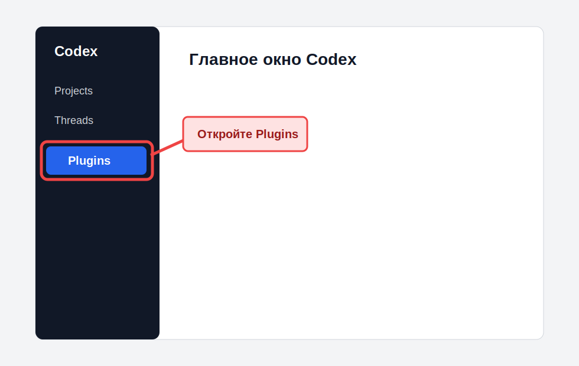
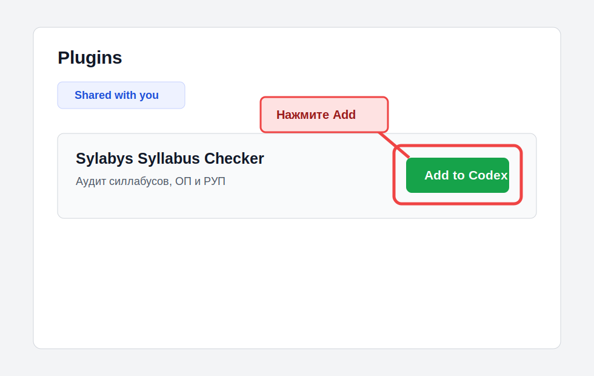
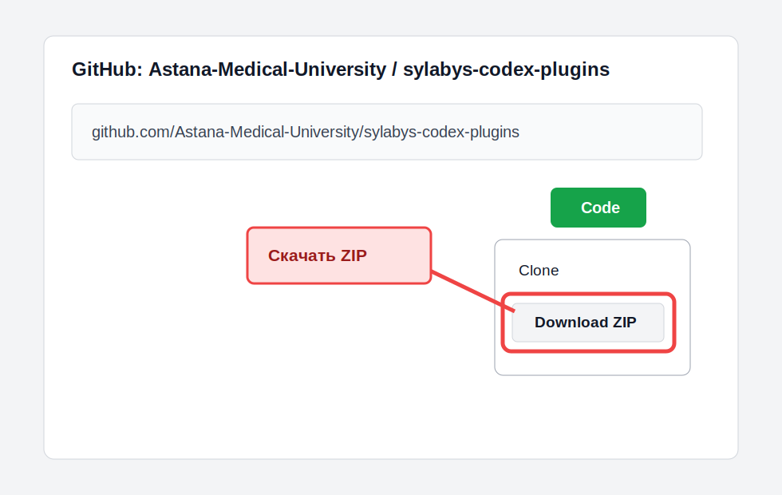
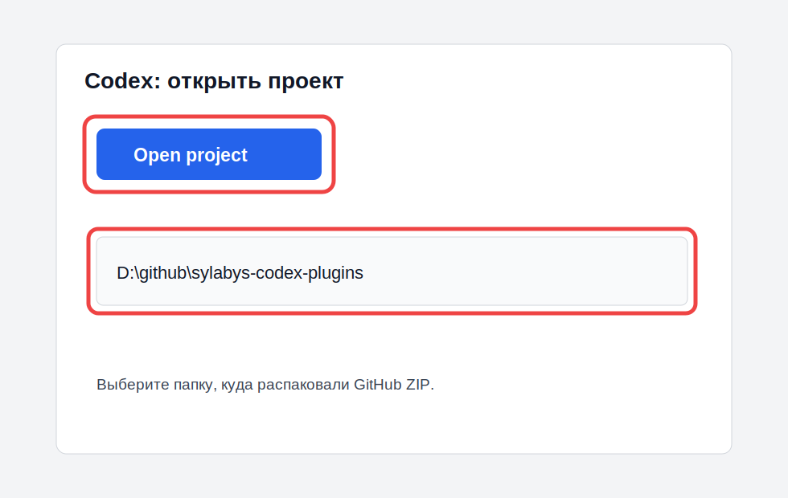
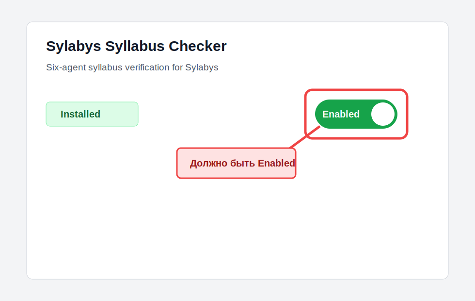
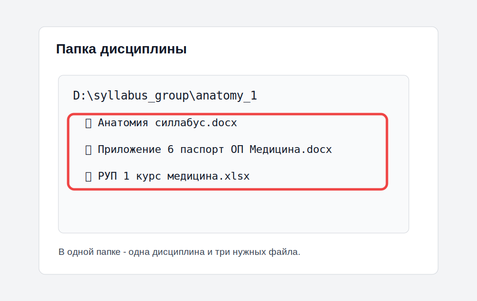
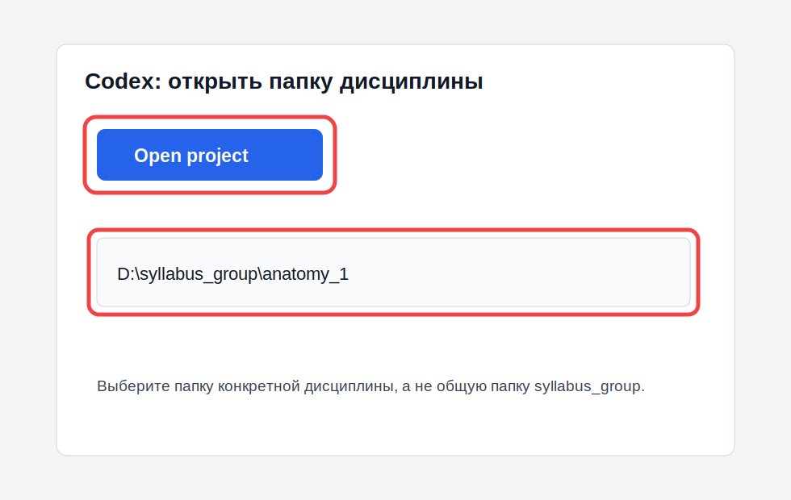
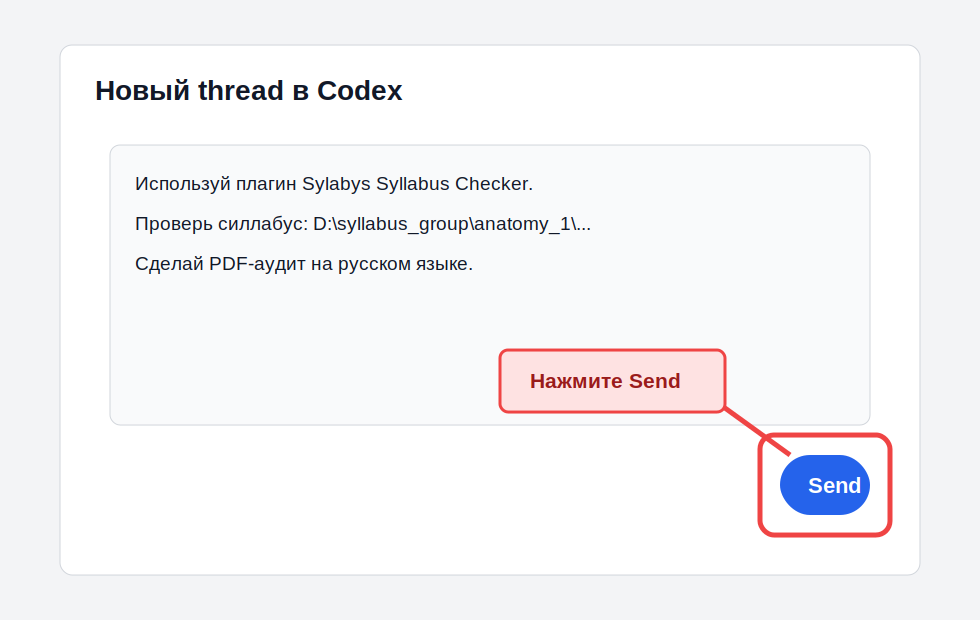
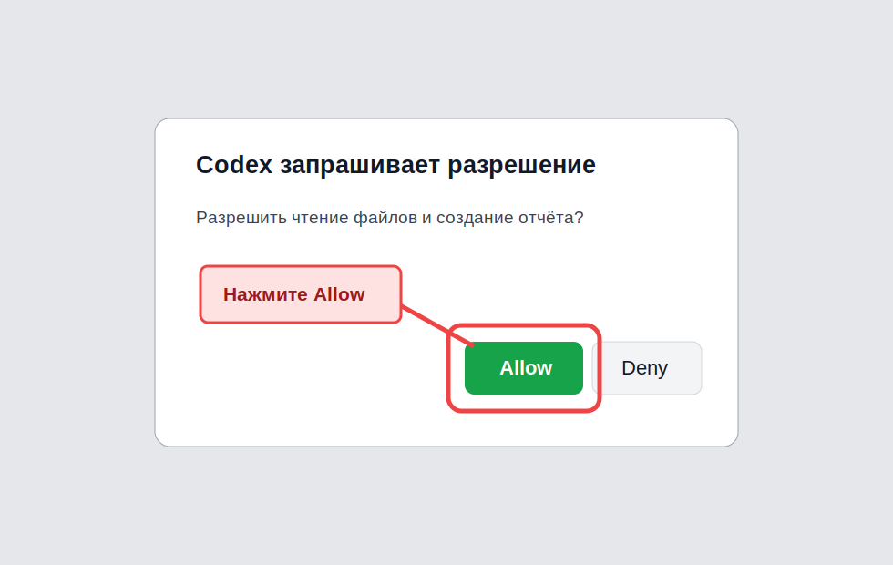
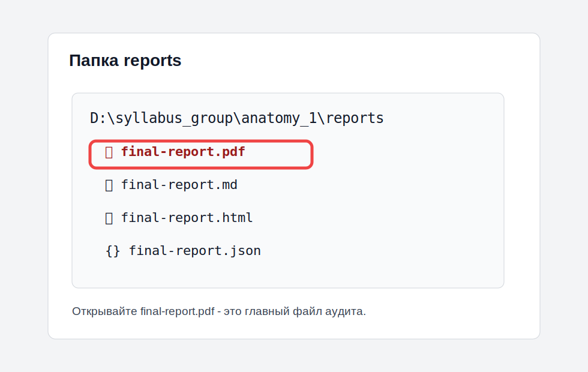

# Инструкция для ППС: Codex app + плагин Sylabys Syllabus Checker

Эта инструкция для преподавателей и сотрудников, которые не работают с командной строкой. Все действия ниже выполняются через приложение Codex и обычные окна Windows.

Важно: если экран у вас немного отличается от скриншота, ориентируйтесь на название кнопки. Интерфейс Codex может обновляться.

## Что получится в конце

Вы сможете загрузить в Codex комплект документов по дисциплине и получить аудит силлабуса в PDF:

```text
reports\final-report.pdf
```

Плагин проверяет:

- структуру силлабуса;
- цель и результаты обучения;
- соответствие ОП, РУП и силлабусу;
- темы и результаты обучения;
- распределение часов: лекции, ПЗ, СРОП, СРО;
- форму итогового контроля;
- литературу;
- вопросы для итогового контроля.

Отчёт будет написан простым русским языком: что исправить, где исправить, уровень исправления, доказательство и как исправить.

## Перед началом

Нужно иметь:

- Windows 10 или Windows 11;
- интернет;
- аккаунт ChatGPT / OpenAI с доступом к Codex;
- доступ к GitHub-репозиторию плагина:
  <https://github.com/Astana-Medical-University/sylabys-codex-plugins>
- Microsoft Edge или Google Chrome, чтобы создавался PDF.

Команды PowerShell, CMD, Git Bash и `codex plugin ...` в этой инструкции не используются.

## 1. Установить Codex app

Откройте ссылку:

<https://get.microsoft.com/installer/download/9PLM9XGG6VKS?cid=website_cta_psi>

Нажмите `Установить` / `Install`.


После установки:

1. Откройте меню `Пуск`.
2. Найдите `Codex`.
3. Откройте приложение.

## 2. Войти в Codex

1. В Codex нажмите `Sign in` / `Войти`.
2. В браузере войдите в аккаунт ChatGPT / OpenAI.
3. Если появится выбор workspace, выберите workspace университета.
4. Вернитесь в Codex.


Если вход не получается, проверьте:

- правильный ли аккаунт используется;
- есть ли у аккаунта доступ к Codex;
- не заблокирован ли вход политикой университета;
- включена ли двухфакторная проверка, если она требуется.

## 3. Как получить плагин без командной строки

Есть два варианта. Для ППС рекомендуется вариант A.

### Вариант A. Плагин расшарен внутри workspace

Этот вариант самый простой. Администратор один раз добавляет плагин и делится им с сотрудниками. Преподаватель просто устанавливает его из Codex app.

1. Откройте Codex.
2. Слева нажмите `Plugins`.
3. Откройте раздел `Shared with you`.
4. Найдите `Sylabys Syllabus Checker`.
5. Нажмите `Add to Codex` / `Install`.
6. Если есть переключатель `Enabled`, включите его.





После установки закройте текущий thread и откройте новый. В новом thread Codex увидит плагин.

### Вариант B. Через GitHub без CLI: скачать marketplace как ZIP

Используйте этот вариант, если плагин ещё не расшарен в workspace.

1. Откройте GitHub-репозиторий:
   <https://github.com/Astana-Medical-University/sylabys-codex-plugins>
2. Нажмите зелёную кнопку `Code`.
3. Нажмите `Download ZIP`.
4. Скачайте архив.
5. Распакуйте архив в удобную папку, например:

   ```text
   D:\github\sylabys-codex-plugins
   ```



Теперь откройте эту папку в Codex:

1. Откройте Codex.
2. Нажмите `Open project` / `Add project`.
3. Выберите папку, куда распаковали репозиторий:

   ```text
   D:\github\sylabys-codex-plugins
   ```

4. Откройте `Plugins`.
5. Найдите источник `Sylabys Codex Plugins`.
6. Установите `Sylabys Syllabus Checker`.



Важно: при варианте B обновления не подтягиваются автоматически. Когда администратор выпустит новую версию, нужно заново скачать ZIP из GitHub и распаковать его поверх старой папки.

## 4. Проверить, что плагин включён

1. Откройте Codex.
2. Откройте `Plugins`.
3. Найдите `Sylabys Syllabus Checker`.
4. Убедитесь, что написано `Installed` / `Установлен`.
5. Если есть переключатель, он должен быть включён.



Если плагина нет:

- проверьте, что вы вошли в правильный workspace;
- проверьте раздел `Shared with you`;
- если использовали ZIP, проверьте, что открыли именно папку `sylabys-codex-plugins`, а не внутреннюю папку `plugins`;
- перезапустите Codex.

## 5. Подготовить папку `syllabus_group`

Создайте папку, где будут лежать документы для проверки. Например:

```text
D:\syllabus_group
```

Внутри создайте отдельную папку для каждой дисциплины:

```text
D:\syllabus_group\anatomy_1
D:\syllabus_group\pathophysiology_1
D:\syllabus_group\pharmacology_1
```

Для одной проверки в одной папке должны быть только документы одной дисциплины.

## 6. Что положить в папку дисциплины

Пример правильной папки:

```text
D:\syllabus_group\anatomy_1
  Анатомия силлабус.docx
  Приложение 6 паспорт ОП Медицина.docx
  РУП 1 курс медицина.xlsx
```



Обязательно нужны три файла:

1. Силлабус в формате `.docx`.
2. Паспорт ОП / приложение 6 в формате `.docx`.
3. РУП / учебный план в формате `.xlsx`.

Чтобы плагин сам нашёл документы, используйте понятные названия:

- для ОП: `Приложение 6`, `паспорт ОП`, `стандарта ОП`;
- для РУП: `РУП`, `учебный план`;
- для силлабуса: название дисциплины + слово `силлабус`.

Не кладите в эту же папку:

- старые версии силлабуса;
- другие дисциплины;
- PDF вместо Word;
- сканы;
- фотографии документов;
- файлы с паролем.

Перед запуском закройте Word и Excel.

## 7. Открыть папку дисциплины в Codex

1. Откройте Codex.
2. Нажмите `Open project` / `Add project`.
3. Выберите папку дисциплины, например:

   ```text
   D:\syllabus_group\anatomy_1
   ```

4. Откройте новый thread.



## 8. Запустить аудит

В новом thread вставьте такой текст. Замените путь и название файла на свои.

```text
Используй плагин Sylabys Syllabus Checker.

Проверь силлабус:
D:\syllabus_group\anatomy_1\Анатомия силлабус.docx

ОП и РУП лежат в этой же папке:
D:\syllabus_group\anatomy_1

Сделай аудит на русском языке:
- что исправить;
- где исправить;
- уровень исправления;
- доказательство;
- как исправить;
- отдельно выпиши форму итогового контроля;
- проверь распределение часов Л/ПЗ/СРОП/СРО;
- проверь литературу;
- подготовь вопросы для итогового контроля;
- сделай PDF-отчёт.

Отчёты сохрани в папке reports.
```

Нажмите кнопку отправки сообщения.



Проверка может занять несколько минут. Не закрывайте Codex, пока идёт аудит.

## 9. Если Codex спрашивает разрешение

Codex может спросить разрешение на чтение файлов, запуск проверки или запись отчёта.

Если путь правильный и Codex работает с вашей папкой дисциплины, нажмите `Allow` / `Разрешить`.



Не разрешайте действие, если Codex предлагает удалить исходные документы или изменить исходный силлабус. Плагин должен создавать отчёт, а не исправлять файл вместо вас.

## 10. Где найти результат

После окончания проверки откройте папку:

```text
D:\syllabus_group\anatomy_1\reports
```

Главный файл:

```text
final-report.pdf
```

Дополнительные файлы:

```text
final-report.md
final-report.html
final-report.json
```



Если PDF не создался:

1. Откройте `final-report.html`.
2. Нажмите `Ctrl + P`.
3. Выберите `Save as PDF`.
4. Сохраните PDF вручную.

## 11. Как читать аудит

Откройте `final-report.pdf`.

Сначала смотрите раздел `Исполнительное заключение`.

Возможные статусы:

- `ПРИНЯТ` - серьёзных замечаний нет;
- `ПРИНЯТ С ЗАМЕЧАНИЯМИ` - можно принять, но лучше исправить замечания;
- `НА ДОРАБОТКУ` - есть существенные замечания;
- `ОТКЛОНЁН` - документ нельзя утверждать до исправлений.

Главный раздел отчёта - `Что исправить`.

В таблице:

- `Где исправить` - раздел документа;
- `Уровень исправления` - насколько серьёзно;
- `Доказательство` - на основании чего сделан вывод;
- `Что не так` - проблема;
- `Как исправить` - что сделать.

Исправлять нужно в таком порядке:

1. `Критический`.
2. `Существенный`.
3. `Точечный`.
4. `Ручная экспертиза`.

## 12. Что делать после исправления

1. Исправьте силлабус в Word.
2. Сохраните новую версию, например:

   ```text
   Анатомия силлабус исправлено.docx
   ```

3. Старую версию уберите в подпапку:

   ```text
   old
   ```

4. Запустите аудит повторно по новой версии.
5. Сравните новый `final-report.pdf` со старым.

## 13. Частые проблемы

### Плагин не отображается

Что сделать:

1. Перезапустите Codex.
2. Откройте новый thread.
3. Проверьте `Plugins`.
4. Проверьте `Shared with you`.
5. Убедитесь, что вы вошли в workspace университета.

### Codex не видит ОП или РУП

Что сделать:

1. Проверьте, что ОП и РУП лежат в той же папке, что и силлабус.
2. Проверьте, что ОП имеет расширение `.docx`.
3. Проверьте, что РУП имеет расширение `.xlsx`.
4. Добавьте в название файла ОП слова `Приложение 6` или `паспорт ОП`.
5. Добавьте в название файла РУП слово `РУП`.

### Отчёт получился странным

Проверьте:

- силлабус не должен быть сканом;
- таблицы должны быть настоящими таблицами Word, а не картинками;
- файл должен открываться в Word;
- в папке не должно быть нескольких силлабусов по разным дисциплинам.

### PDF не появился

Откройте `final-report.html` и сохраните его как PDF через браузер.

## 14. Что отправить ответственному, если не получилось

Отправьте:

- скриншот ошибки;
- путь к папке дисциплины;
- список файлов в папке;
- файл `final-report.json`, если он появился;
- версию плагина, если она видна в Plugins.

Не отправляйте пароль, API-ключи, токены и файлы входа в Codex.

## 15. Короткая памятка

1. Установить Codex app.
2. Войти в аккаунт университета.
3. Открыть `Plugins`.
4. Установить `Sylabys Syllabus Checker` из `Shared with you`.
5. Создать папку дисциплины в `D:\syllabus_group`.
6. Положить туда силлабус `.docx`, ОП `.docx`, РУП `.xlsx`.
7. Открыть папку дисциплины в Codex.
8. В новом thread попросить: `Используй плагин Sylabys Syllabus Checker и сделай PDF-аудит`.
9. Забрать файл:

   ```text
   reports\final-report.pdf
   ```

## 16. Официальные ссылки

- Codex for Windows: <https://developers.openai.com/codex/app/windows>
- Codex quickstart: <https://developers.openai.com/codex/quickstart>
- Codex authentication: <https://developers.openai.com/codex/auth>
- Codex plugins: <https://developers.openai.com/codex/plugins>
- Build plugins / marketplace: <https://developers.openai.com/codex/plugins/build>
- Репозиторий Sylabys plugins: <https://github.com/Astana-Medical-University/sylabys-codex-plugins>
